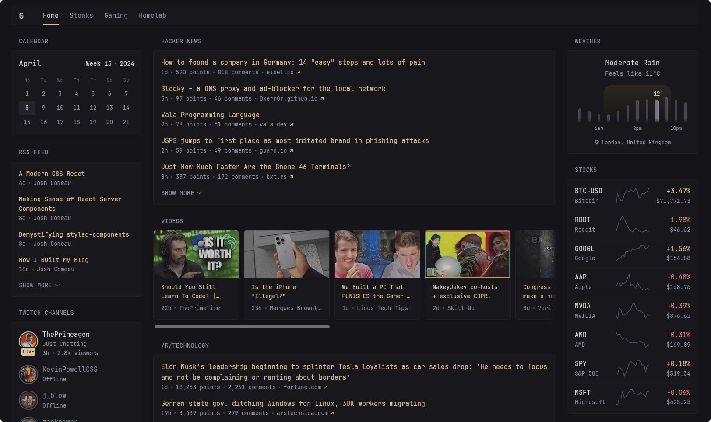
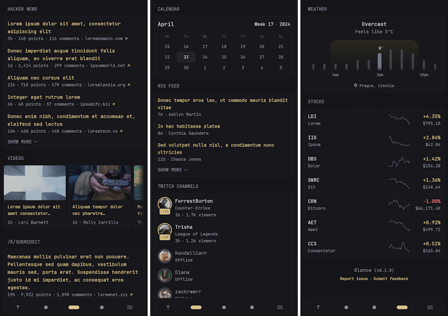
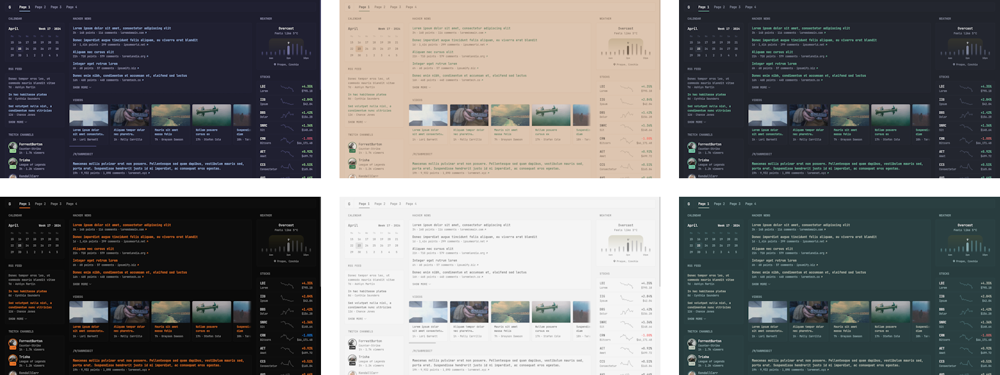

<p align="center"><em>What if you could see everything at a...</em></p>
<h1 align="center">Glance</h1>
<p align="center"><a href="#installation">Install</a> • <a href="docs/configuration.md#configuring-glance">Configuration</a> • <a href="https://discord.com/invite/7KQ7Xa9kJd">Discord</a> • <a href="https://github.com/sponsors/glanceapp">Sponsor</a></p>
<p align="center"><a href="https://github.com/glanceapp/community-widgets">Community widgets</a> • <a href="docs/preconfigured-pages.md">Preconfigured pages</a> • <a href="docs/themes.md">Themes</a></p>



## Features
### Various widgets
* RSS feeds
* Subreddit posts
* Hacker News posts
* Weather forecasts
* YouTube channel uploads
* Twitch channels
* Market prices
* Docker containers status
* Server stats
* Custom widgets
* [and many more...](docs/configuration.md#configuring-glance)

### Fast and lightweight
* Low memory usage
* Few dependencies
* Minimal vanilla JS
* Single <20mb binary available for multiple OSs & architectures and just as small Docker container
* Uncached pages usually load within ~1s (depending on internet speed and number of widgets)

### Tons of customizability
* Different layouts
* As many pages/tabs as you need
* Numerous configuration options for each widget
* Multiple styles for some widgets
* Custom CSS

### Optimized for mobile devices
Because you'll want to take it with you on the go.



### Themeable
Easily create your own theme by tweaking a few numbers or choose from one of the [already available themes](docs/themes.md).



<br>

## Configuration
Configuration is done through YAML files, to learn more about how the layout works, how to add more pages and how to configure widgets, visit the [configuration documentation](docs/configuration.md#configuring-glance).
<details>
<summary><strong>Preview example configuration file</strong></summary>
<br>

```yaml
pages:
  - name: Home
    columns:
      - size: small
        widgets:
          - type: calendar
            first-day-of-week: monday

          - type: rss
            limit: 10
            collapse-after: 3
            cache: 12h
            feeds:
              - url: https://selfh.st/rss/
                title: selfh.st
                limit: 4
              - url: https://ciechanow.ski/atom.xml
              - url: https://www.joshwcomeau.com/rss.xml
                title: Josh Comeau
              - url: https://samwho.dev/rss.xml
              - url: https://ishadeed.com/feed.xml
                title: Ahmad Shadeed

          - type: twitch-channels
            channels:
              - theprimeagen
              - j_blow
              - piratesoftware
              - cohhcarnage
              - christitustech
              - EJ_SA

      - size: full
        widgets:
          - type: group
            widgets:
              - type: hacker-news
              - type: lobsters

          - type: videos
            channels:
              - UCXuqSBlHAE6Xw-yeJA0Tunw # Linus Tech Tips
              - UCR-DXc1voovS8nhAvccRZhg # Jeff Geerling
              - UCsBjURrPoezykLs9EqgamOA # Fireship
              - UCBJycsmduvYEL83R_U4JriQ # Marques Brownlee
              - UCHnyfMqiRRG1u-2MsSQLbXA # Veritasium

          - type: group
            widgets:
              - type: reddit
                subreddit: technology
                show-thumbnails: true
              - type: reddit
                subreddit: selfhosted
                show-thumbnails: true

      - size: small
        widgets:
          - type: weather
            location: London, United Kingdom
            units: metric
            hour-format: 12h

          - type: markets
            markets:
              - symbol: SPY
                name: S&P 500
              - symbol: BTC-USD
                name: Bitcoin
              - symbol: NVDA
                name: NVIDIA
              - symbol: AAPL
                name: Apple
              - symbol: MSFT
                name: Microsoft

          - type: releases
            cache: 1d
            repositories:
              - glanceapp/glance
              - go-gitea/gitea
              - immich-app/immich
              - syncthing/syncthing
```
</details>

<br>

## Installation

Choose one of the following methods:

<details>
<summary><strong>Docker compose using provided directory structure (recommended)</strong></summary>
<br>

Create a new directory called `glance` as well as the template files within it by running:

```bash
mkdir glance && cd glance && curl -sL https://github.com/glanceapp/docker-compose-template/archive/refs/heads/main.tar.gz | tar -xzf - --strip-components 2
```

*[click here to view the files that will be created](https://github.com/glanceapp/docker-compose-template/tree/main/root)*

Then, edit the following files as desired:
* `docker-compose.yml` to configure the port, volumes and other containery things
* `config/home.yml` to configure the widgets or layout of the home page
* `config/glance.yml` if you want to change the theme or add more pages

<details>
<summary>Other files you may want to edit</summary>

* `.env` to configure environment variables that will be available inside configuration files
* `assets/user.css` to add custom CSS
</details>

When ready, run:

```bash
docker compose up -d
```

If you encounter any issues, you can check the logs by running:

```bash
docker compose logs
```

<hr>
</details>

<details>
<summary><strong>Docker compose manual</strong></summary>
<br>

Create a `docker-compose.yml` file with the following contents:

```yaml
services:
  glance:
    container_name: glance
    image: glanceapp/glance
    restart: unless-stopped
    volumes:
      - ./config:/app/config
    ports:
      - 8080:8080
```

Then, create a new directory called `config` and download the example starting [`glance.yml`](https://github.com/glanceapp/glance/blob/main/docs/glance.yml) file into it by running:

```bash
mkdir config && wget -O config/glance.yml https://raw.githubusercontent.com/glanceapp/glance/refs/heads/main/docs/glance.yml
```

Feel free to edit the `glance.yml` file to your liking, and when ready run:

```bash
docker compose up -d
```

If you encounter any issues, you can check the logs by running:

```bash
docker logs glance
```

<hr>
</details>

<details>
<summary><strong>Manual binary installation</strong></summary>
<br>

Precompiled binaries are available for Linux, Windows and macOS (x86, x86_64, ARM and ARM64 architectures).

### Linux

Visit the [latest release page](https://github.com/glanceapp/glance/releases/latest) for available binaries. You can place the binary in `/opt/glance/` and have it start with your server via a [systemd service](https://linuxhandbook.com/create-systemd-services/). By default, when running the binary, it will look for a `glance.yml` file in the directory it's placed in. To specify a different path for the config file, use the `--config` option:

```bash
/opt/glance/glance --config /etc/glance.yml
```

To grab a starting template for the config file, run:

```bash
wget https://raw.githubusercontent.com/glanceapp/glance/refs/heads/main/docs/glance.yml
```

### Windows

Download and extract the executable from the [latest release](https://github.com/glanceapp/glance/releases/latest) (most likely the file called `glance-windows-amd64.zip` if you're on a 64-bit system) and place it in a folder of your choice. Then, create a new text file called `glance.yml` in the same folder and paste the content from [here](https://raw.githubusercontent.com/glanceapp/glance/refs/heads/main/docs/glance.yml) in it. You should then be able to run the executable and access the dashboard by visiting `http://localhost:8080` in your browser.


<hr>
</details>

<details>
<summary><strong>Other</strong></summary>
<br>

Glance can also be installed through the following 3rd party channels:
* [Proxmox VE Helper Script](https://community-scripts.github.io/ProxmoxVE/scripts?id=glance)
* [NixOS package](https://search.nixos.org/packages?channel=unstable&show=glance)
* [Coolify.io](https://coolify.io/docs/services/glance/)

<hr>
</details>

<br>

## Common issues
<details>
<summary><strong>Requests timing out</strong></summary>

The most common cause of this is when using Pi-Hole, AdGuard Home or other ad-blocking DNS services, which by default have a fairly low rate limit. Depending on the number of widgets you have in a single page, this limit can very easily be exceeded. To fix this, increase the rate limit in the settings of your DNS service.

If using Podman, in some rare cases the timeout can be caused by an unknown issue, in which case it may be resolved by adding the following to the bottom of your `docker-compose.yml` file:
```yaml
networks:
  podman:
    external: true
```
</details>

<details>
<summary><strong>Broken layout for markets, bookmarks or other widgets</strong></summary>

This is almost always caused by the browser extension Dark Reader. To fix this, disable dark mode for the domain where Glance is hosted.
</details>

<details>
<summary><strong>cannot unmarshal !!map into []glance.page</strong></summary>

The most common cause of this is having a `pages` key in your `glance.yml` and then also having a `pages` key inside one of your included pages. To fix this, remove the `pages` key from the top of your included pages.

</details>

<br>

## FAQ
<details>
<summary><strong>Does the information on the page update automatically?</strong></summary>
No, a page refresh is required to update the information. Some things do dynamically update where it makes sense, like the clock widget and the relative time showing how long ago something happened.
</details>

<details>
<summary><strong>How frequently do widgets update?</strong></summary>
No requests are made periodically in the background, information is only fetched upon loading the page and then cached. The default cache lifetime is different for each widget and can be configured.
</details>

<details>
<summary><strong>Can I create my own widgets?</strong></summary>

Yes, there are multiple ways to create custom widgets:
* `iframe` widget - allows you to embed things from other websites
* `html` widget - allows you to insert your own static HTML
* `extension` widget - fetch HTML from a URL
* `custom-api` widget - fetch JSON from a URL and render it using custom HTML
</details>

<details>
<summary><strong>Can I change the title of a widget?</strong></summary>

Yes, the title of all widgets can be changed by specifying the `title` property in the widget's configuration:

```yaml
- type: rss
  title: My custom title

- type: markets
  title: My custom title

- type: videos
  title: My custom title

# and so on for all widgets...
```
</details>

<br>

## Feature requests

New feature suggestions are always welcome and will be considered, though please keep in mind that some of them may be out of scope for what the project is trying to achieve (or is reasonably capable of). If you have an idea for a new feature and would like to share it, you can do so [here](https://github.com/glanceapp/glance/issues/new?template=feature_request.yml).

Feature requests are tagged with one of the following:

* [Roadmap](https://github.com/glanceapp/glance/labels/roadmap) - will be implemented in a future release
* [Backlog](https://github.com/glanceapp/glance/labels/backlog) - may be implemented in the future but needs further feedback or interest from the community
* [Icebox](https://github.com/glanceapp/glance/labels/icebox) - no plans to implement as it doesn't currently align with the project's goals or capabilities, may be revised at a later date

<br>

## Building from source

Choose one of the following methods:

<details>
<summary><strong>Build binary with Go</strong></summary>
<br>

Requirements: [Go](https://go.dev/dl/) >= v1.23

To build the project for your current OS and architecture, run:

```bash
go build -o build/glance .
```

To build for a specific OS and architecture, run:

```bash
GOOS=linux GOARCH=amd64 go build -o build/glance .
```

[*click here for a full list of GOOS and GOARCH combinations*](https://go.dev/doc/install/source#:~:text=$GOOS%20and%20$GOARCH)

Alternatively, if you just want to run the app without creating a binary, like when you're testing out changes, you can run:

```bash
go run .
```
<hr>
</details>

<details>
<summary><strong>Build project and Docker image with Docker</strong></summary>
<br>

Requirements: [Docker](https://docs.docker.com/engine/install/)

To build the project and image using just Docker, run:

*(replace `owner` with your name or organization)*

```bash
docker build -t owner/glance:latest .
```

If you wish to push the image to a registry (by default Docker Hub), run:

```bash
docker push owner/glance:latest
```

<hr>
</details>

<br>

## Contributing guidelines

* Before working on a new feature it's preferable to submit a feature request first and state that you'd like to implement it yourself
* Please don't submit PRs for feature requests that are either in the roadmap<sup>[1]</sup>, backlog<sup>[2]</sup> or icebox<sup>[3]</sup>
* Use `dev` for the base branch if you're adding new features or fixing bugs, otherwise use `main`
* Avoid introducing new dependencies
* Avoid making backwards-incompatible configuration changes
* Avoid introducing new colors or hard-coding colors, use the standard `primary`, `positive` and `negative`
* For icons, try to use [heroicons](https://heroicons.com/) where applicable
* Provide a screenshot of the changes if UI related where possible
* No `package.json`

<details>
<summary><strong><sup>[1] [2] [3]</sup></strong></summary>

[1] The feature likely already has work put into it that may conflict with your implementation

[2] The demand, implementation or functionality for this feature is not yet clear

[3] No plans to add this feature for the time being

</details>

<br>

## Thank you

To all the people who were generous enough to [sponsor](https://github.com/sponsors/glanceapp) the project and to everyone who has contributed in any way, be it PRs, submitting issues, helping others in the discussions or Discord server, creating guides and tools or just mentioning Glance on social media. Your support is greatly appreciated and helps keep the project going.
