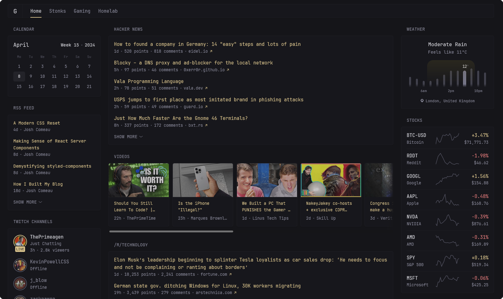

<p align="center"></p>
<h1 align="center">Glance</h1>
<p align="center">
  <a href="#installation">Install</a> •
  <a href="docs/configuration.md#configuring-glance">Configuration</a> •
  <a href="https://discord.com/invite/7KQ7Xa9kJd">Discord</a> •
  <a href="https://github.com/sponsors/glanceapp">Sponsor</a>
</p>
<p align="center">
  <a href="https://github.com/glanceapp/community-widgets">Community widgets</a> •
  <a href="docs/preconfigured-pages.md">Preconfigured pages</a> •
  <a href="docs/themes.md">Themes</a>
</p>

<p align="center">A lightweight, highly customizable dashboard that displays<br> your feeds in a beautiful, streamlined interface</p>



### Problem Statement
Previously, when a monitored service changed status, users had to manually refresh the page to see the updated state. This created a poor user experience for services with frequently changing states.

### Solution
Implemented a push-based real-time notification system using:

* Server-Sent Events (SSE) for bidirectional server-to-client communication
* Background monitoring worker that polls service status at regular intervals
* Event debouncing to prevent notification spam during service flapping
* Partial DOM updates to efficiently refresh only affected widgets
* Guard mechanisms to prevent duplicate initialization of UI components
* More detailes - LIVE_EVENTS_IMPLEMENTATION •
* Docker compose using provided directory structure (recommended)

Create a new directory called `glance` as well as the template files within it by running:
When ready, run:

```bash
docker compose up -d
```
```bash
services:
  glance:
    image: ghcr.io/frozendark01/glance:main
    container_name: glance
    restart: unless-stopped
    # If you need Glance to see services running directly on the host (e.g. DNS on port 53)
      # you can use network_mode: host or add-host
    ports:
      - "8080:8080"
    volumes:
      - ./config:/app/config:ro # add glance.yml to config folder
      # If you have custom assets (CSS/JS) that you want to test without rebuilding
      # - ./public:/app/public:ro
    environment:
      - TZ=Etc/UTC
      - GLANCE_CONFIG=/app/glance.yml
    # Important for SSE (Live Events) data flow
    logging:
      driver: "json-file"
      options:
        max-size: "10mb"
        max-file: "3"
```
TO DO: add the same Live Events to custom-api widgets.

Thank you