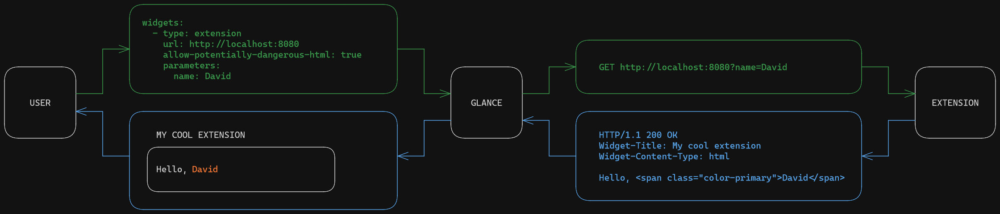
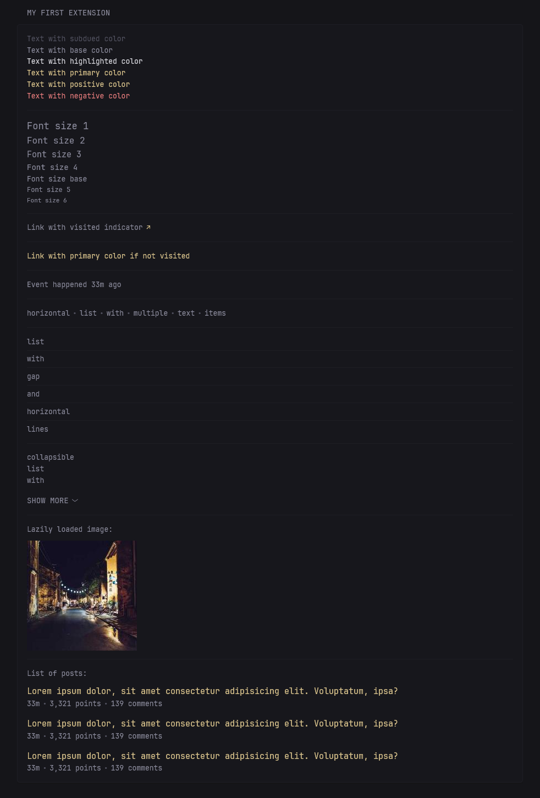

# Extensions

> [!IMPORTANT]
>
> **This document as well as the extensions feature are a work in progress. The API may change in the future. You are responsible for maintaining your own extensions.**

## Overview

With the intention of requiring minimal knowledge in order to develop extensions, rather than being a convoluted protocol they are nothing more than an HTTP request to a server that returns a few special headers. The exchange between Glance and extensions can be seen in the following diagram:



If you know how to setup an HTTP server and a bit of HTML and CSS you're ready to start building your own extensions.

> [!TIP]
>
> By default, the extension widget has a cache time of 30 minutes. To avoid having to restart Glance after every extension change you can set the cache time of the widget to 1 second:
> ```yaml
> - type: extension
>   url: http://localhost:8081
>   cache: 1s
> ```

## Headers

### `Widget-Title`
Used to specify the title of the widget. If not provided, the widget's title will be "Extension".

### `Widget-Title-URL`
Used to specify the URL that will be opened when the widget's title is clicked. If the user has specified a `title-url` in their config, it will take precedence over this header.

### `Widget-Content-Type`
Used to specify the content type that will be returned by the extension. If not provided, the content will be shown as plain text.

### `Widget-Content-Frameless`
When set to `true`, the widget's content will be displayed without the default background or "frame".

## Content Types

> [!NOTE]
>
> Currently, `html` is the only supported content type. The long-term goal is to have generic content types such as `videos`, `forum-posts`, `markets`, `streams`, etc. which will be returned in JSON format and displayed by Glance using existing styles and functionality, allowing extension developers to achieve a native look while only focusing on providing data from their preferred source.

### `html`
Displays the content as HTML. This requires the user to have the `allow-potentially-dangerous-html` property set to `true`, otherwise the content will be shown as plain text.


#### Using existing classes and functionality
Most of the features seen throughout Glance can easily be used in your custom HTML extensions. Below is an example of some of these features:

```html
<p class="color-subdue">Text with subdued color</p>
<p>Text with base color</p>
<p class="color-highlight">Text with highlighted color</p>
<p class="color-primary">Text with primary color</p>
<p class="color-positive">Text with positive color</p>
<p class="color-negative">Text with negative color</p>

<hr class="margin-block-15">

<p class="size-h1">Font size 1</p>
<p class="size-h2">Font size 2</p>
<p class="size-h3">Font size 3</p>
<p class="size-h4">Font size 4</p>
<p class="size-base">Font size base</p>
<p class="size-h5">Font size 5</p>
<p class="size-h6">Font size 6</p>

<hr class="margin-block-15">

<a class="visited-indicator" href="#notvisitedprobably">Link with visited indicator</a>

<hr class="margin-block-15">

<a class="color-primary-if-not-visited" href="#notvisitedprobably">Link with primary color if not visited</a>

<hr class="margin-block-15">

<p>Event happened <span data-dynamic-relative-time="<unix timestamp>"></span> ago</p>

<hr class="margin-block-15">

<ul class="list-horizontal-text">
    <li>horizontal</li>
    <li>list</li>
    <li>with</li>
    <li>multiple</li>
    <li>text</li>
    <li>items</li>
</ul>

<hr class="margin-block-15">

<ul class="list list-gap-10 list-with-separator">
    <li>list</li>
    <li>with</li>
    <li>gap</li>
    <li>and</li>
    <li>horizontal</li>
    <li>lines</li>
</ul>

<hr class="margin-block-15">

<ul class="list collapsible-container" data-collapse-after="3">
    <li>collapsible</li>
    <li>list</li>
    <li>with</li>
    <li>many</li>
    <li>items</li>
    <li>that</li>
    <li>will</li>
    <li>appear</li>
    <li>when</li>
    <li>you</li>
    <li>click</li>
    <li>the</li>
    <li>button</li>
    <li>below</li>
</ul>

<hr class="margin-bottom-15">

<p class="margin-bottom-10">Lazily loaded image:</p>


<hr class="margin-block-15">

<p class="margin-bottom-10">List of posts:</p>

<ul class="list list-gap-14 collapsible-container" data-collapse-after="5">
    <li>
        <a class="size-h3 color-primary-if-not-visited" href="#link">Lorem ipsum dolor, sit amet consectetur adipisicing elit. Voluptatum, ipsa?</a>
        <ul class="list-horizontal-text">
            <li data-dynamic-relative-time="<unix timestamp>"></li>
            <li>3,321 points</li>
            <li>139 comments</li>
        </ul>
    </li>
    <li>
        <a class="size-h3 color-primary-if-not-visited" href="#link">Lorem ipsum dolor, sit amet consectetur adipisicing elit. Voluptatum, ipsa?</a>
        <ul class="list-horizontal-text">
            <li data-dynamic-relative-time="<unix timestamp>"></li>
            <li>3,321 points</li>
            <li>139 comments</li>
        </ul>
    </li>
    <li>
        <a class="size-h3 color-primary-if-not-visited" href="#link">Lorem ipsum dolor, sit amet consectetur adipisicing elit. Voluptatum, ipsa?</a>
        <ul class="list-horizontal-text">
            <li data-dynamic-relative-time="<unix timestamp>"></li>
            <li>3,321 points</li>
            <li>139 comments</li>
        </ul>
    </li>
</ul>
```

All of that will result in the following:



**Class names or features may change, once again, you are responsible for maintaining your own extensions.**
