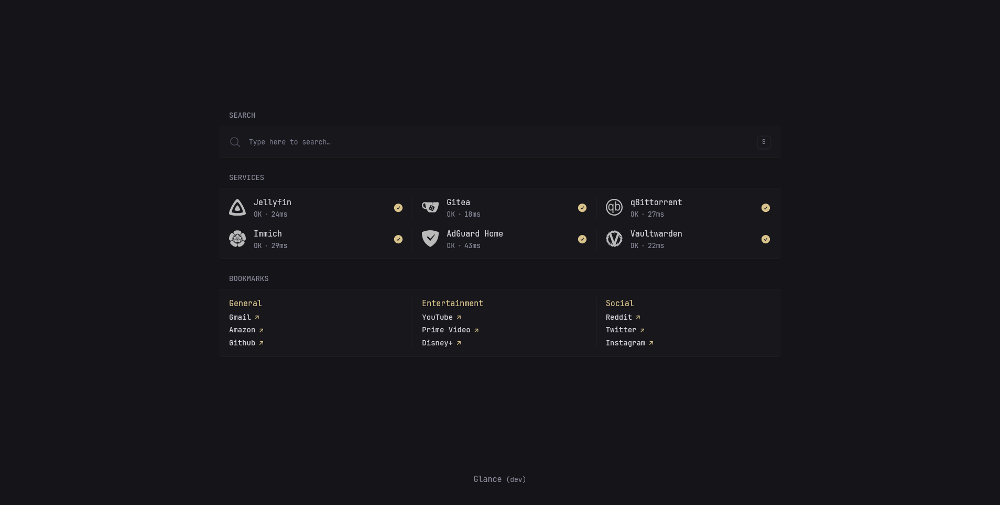
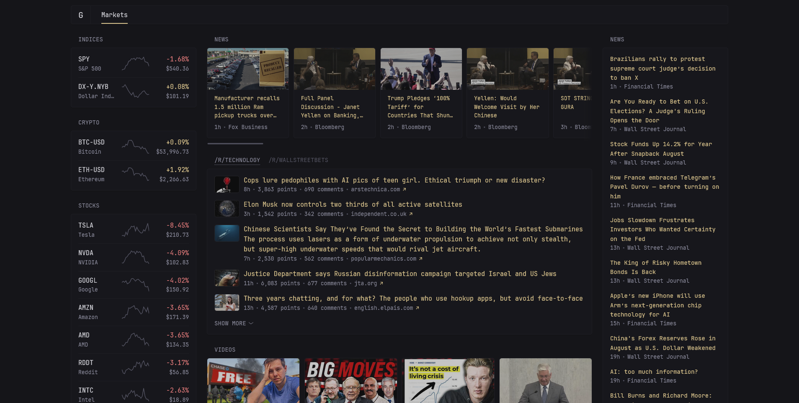
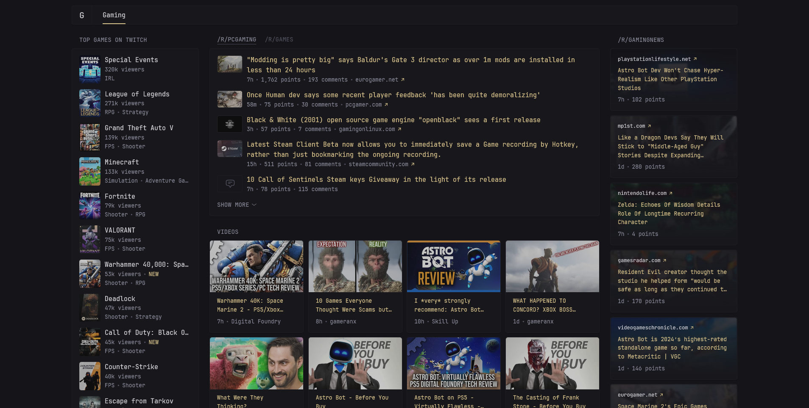

# Preconfigured pages

Don't want to spend time configuring pages from scratch? No problem! Simply copy the config from the ones below.

Pull requests with your page configurations are welcome!

> [!NOTE]
>
> Pages must be placed under a top level `pages:` key, you can read more about that [here](configuration.md#pages).

## Startpage



<details>
<summary>View config (requires Glance <code>v0.6.0</code> or higher)</summary>

```yaml
- name: Startpage
  width: slim
  hide-desktop-navigation: true
  center-vertically: true
  columns:
    - size: full
      widgets:
        - type: search
          autofocus: true

        - type: monitor
          cache: 1m
          title: Services
          sites:
            - title: Jellyfin
              url: https://yourdomain.com/
              icon: si:jellyfin
            - title: Gitea
              url: https://yourdomain.com/
              icon: si:gitea
            - title: qBittorrent # only for Linux ISOs, of course
              url: https://yourdomain.com/
              icon: si:qbittorrent
            - title: Immich
              url: https://yourdomain.com/
              icon: si:immich
            - title: AdGuard Home
              url: https://yourdomain.com/
              icon: si:adguard
            - title: Vaultwarden
              url: https://yourdomain.com/
              icon: si:vaultwarden

        - type: bookmarks
          groups:
            - title: General
              links:
                - title: Gmail
                  url: https://mail.google.com/mail/u/0/
                - title: Amazon
                  url: https://www.amazon.com/
                - title: Github
                  url: https://github.com/
            - title: Entertainment
              links:
                - title: YouTube
                  url: https://www.youtube.com/
                - title: Prime Video
                  url: https://www.primevideo.com/
                - title: Disney+
                  url: https://www.disneyplus.com/
            - title: Social
              links:
                - title: Reddit
                  url: https://www.reddit.com/
                - title: Twitter
                  url: https://twitter.com/
                - title: Instagram
                  url: https://www.instagram.com/
```
</details>

## Markets



<details>
<summary>View config (requires Glance <code>v0.6.0</code> or higher)</summary>

```yaml
  - name: Markets
    columns:
      - size: small
        widgets:
          - type: markets
            title: Indices
            markets:
              - symbol: SPY
                name: S&P 500
              - symbol: DX-Y.NYB
                name: Dollar Index

          - type: markets
            title: Crypto
            markets:
              - symbol: BTC-USD
                name: Bitcoin
              - symbol: ETH-USD
                name: Ethereum

          - type: markets
            title: Stocks
            sort-by: absolute-change
            markets:
              - symbol: NVDA
                name: NVIDIA
              - symbol: AAPL
                name: Apple
              - symbol: MSFT
                name: Microsoft
              - symbol: GOOGL
                name: Google
              - symbol: AMD
                name: AMD
              - symbol: RDDT
                name: Reddit
              - symbol: AMZN
                name: Amazon
              - symbol: TSLA
                name: Tesla
              - symbol: INTC
                name: Intel
              - symbol: META
                name: Meta

      - size: full
        widgets:
          - type: rss
            title: News
            style: horizontal-cards
            feeds:
              - url: https://feeds.bloomberg.com/markets/news.rss
                title: Bloomberg
              - url: https://moxie.foxbusiness.com/google-publisher/markets.xml
                title: Fox Business
              - url: https://moxie.foxbusiness.com/google-publisher/technology.xml
                title: Fox Business

          - type: group
            widgets:
              - type: reddit
                show-thumbnails: true
                subreddit: technology
              - type: reddit
                show-thumbnails: true
                subreddit: wallstreetbets

          - type: videos
            style: grid-cards
            collapse-after-rows: 3
            channels:
              - UCvSXMi2LebwJEM1s4bz5IBA # New Money
              - UCV6KDgJskWaEckne5aPA0aQ # Graham Stephan
              - UCAzhpt9DmG6PnHXjmJTvRGQ # Federal Reserve

      - size: small
        widgets:
          - type: rss
            title: News
            limit: 30
            collapse-after: 13
            feeds:
              - url: https://www.ft.com/technology?format=rss
                title: Financial Times
              - url: https://feeds.a.dj.com/rss/RSSMarketsMain.xml
                title: Wall Street Journal
```
</details>

## Gaming



<details>
<summary>View config (requires Glance <code>v0.6.0</code> or higher)</summary>

```yaml
- name: Gaming
  columns:
    - size: small
      widgets:
        - type: twitch-top-games
          limit: 20
          collapse-after: 13
          exclude:
            - just-chatting
            - pools-hot-tubs-and-beaches
            - music
            - art
            - asmr

    - size: full
      widgets:
        - type: group
          widgets:
            - type: reddit
              show-thumbnails: true
              subreddit: pcgaming
            - type: reddit
              subreddit: games

        - type: videos
          style: grid-cards
          collapse-after-rows: 3
          channels:
            - UCNvzD7Z-g64bPXxGzaQaa4g # gameranx
            - UCZ7AeeVbyslLM_8-nVy2B8Q # Skill Up
            - UCHDxYLv8iovIbhrfl16CNyg # GameLinked
            - UC9PBzalIcEQCsiIkq36PyUA # Digital Foundry

    - size: small
      widgets:
        - type: reddit
          subreddit: gamingnews
          limit: 7
          style: vertical-cards
```
</details>
