# Themes

## Dark

### Teal City
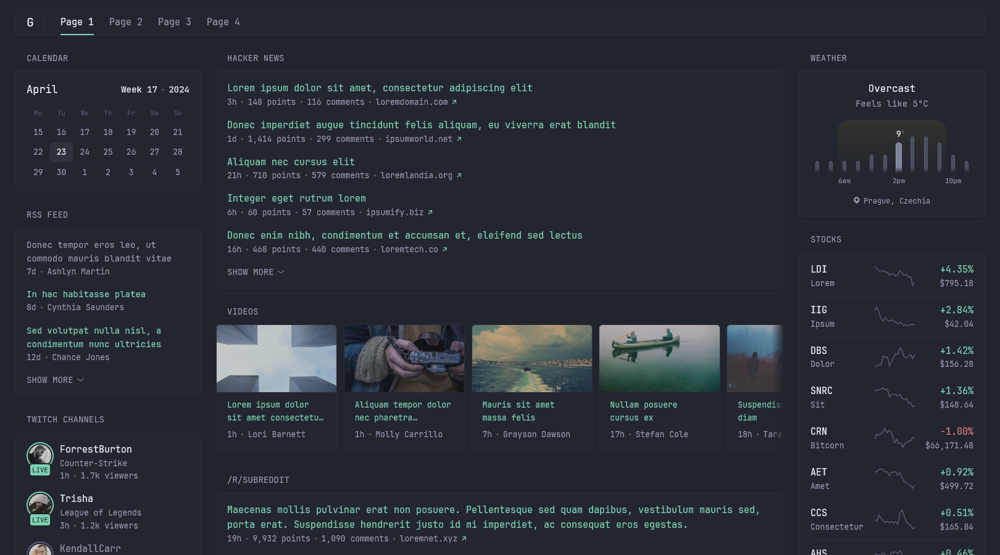
```yaml
theme:
  background-color: 225 14 15
  primary-color: 157 47 65
  contrast-multiplier: 1.1
```

### Catppuccin Frappe
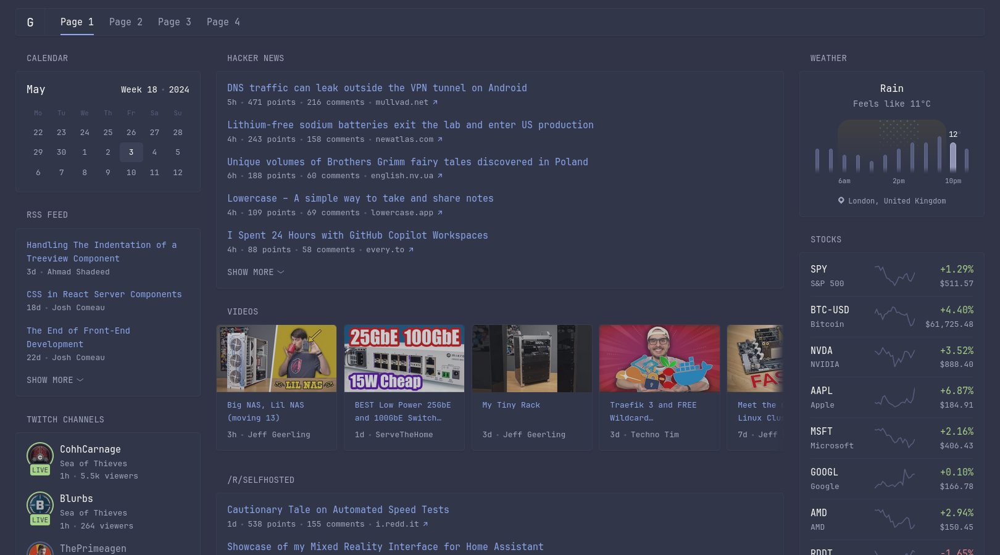
```yaml
theme:
  background-color: 229 19 23
  contrast-multiplier: 1.2
  primary-color: 222 74 74
  positive-color: 96 44 68
  negative-color: 359 68 71
```

### Catppuccin Macchiato
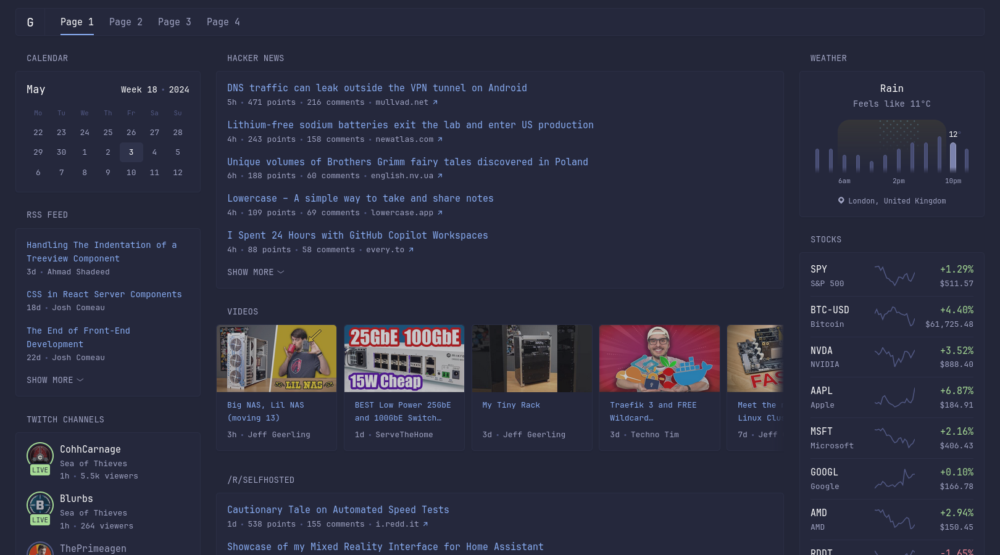
```yaml
theme:
  background-color: 232 23 18
  contrast-multiplier: 1.2
  primary-color: 220 83 75
  positive-color: 105 48 72
  negative-color: 351 74 73
```

### Catppuccin Mocha
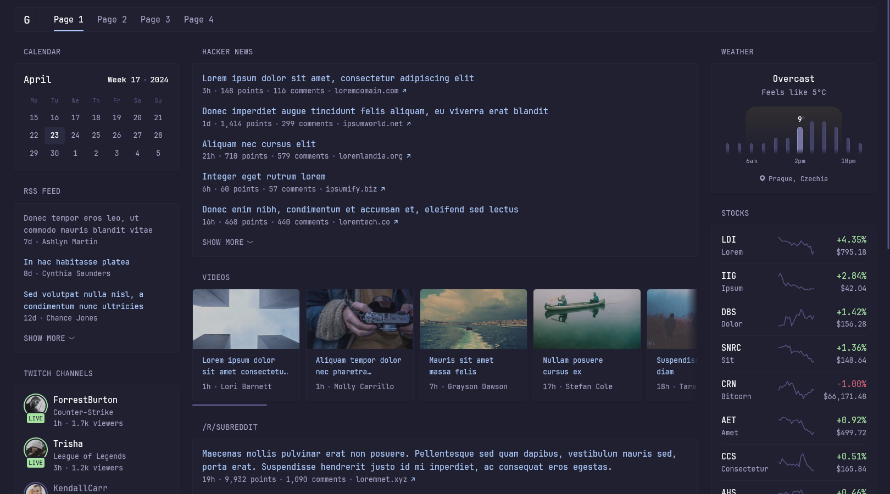
```yaml
theme:
  background-color: 240 21 15
  contrast-multiplier: 1.2
  primary-color: 217 92 83
  positive-color: 115 54 76
  negative-color: 347 70 65
```

### Camouflage
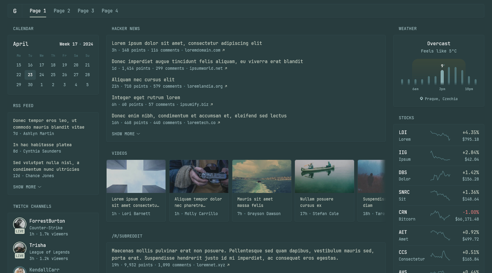
```yaml
theme:
  background-color: 186 21 20
  contrast-multiplier: 1.2
  primary-color: 97 13 80
```

### Gruvbox Dark
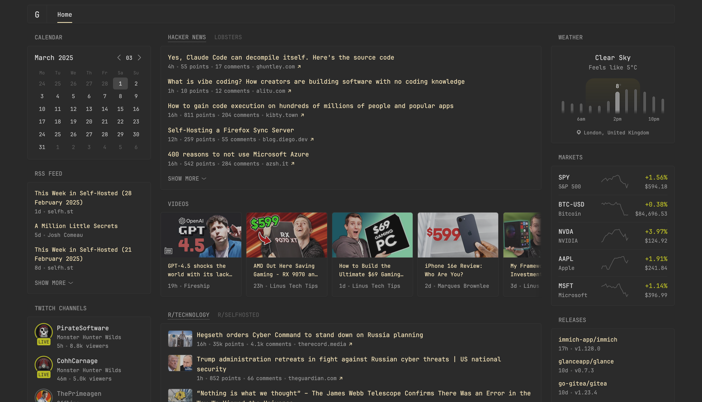
```yaml
theme:
  background-color: 0 0 16
  primary-color: 43 59 81
  positive-color: 61 66 44
  negative-color: 6 96 59
```

### Kanagawa Dark
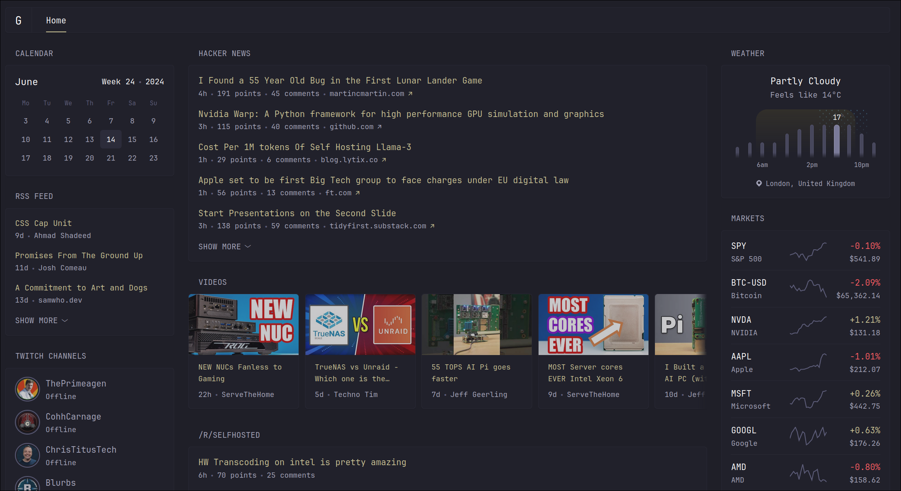
```yaml
theme:
  background-color: 240 13 14
  primary-color: 51 33 68
  negative-color: 358 100 68
  contrast-multiplier: 1.2
```

### Tucan
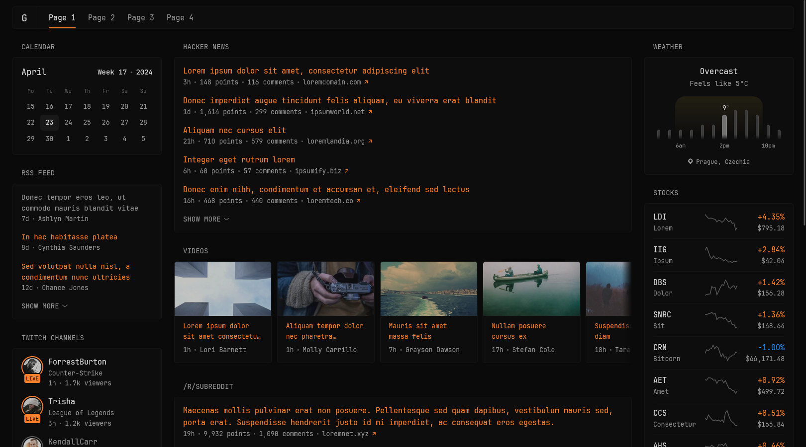
```yaml
theme:
  background-color: 50 1 6
  primary-color: 24 97 58
  negative-color: 209 88 54
```

### Dracula
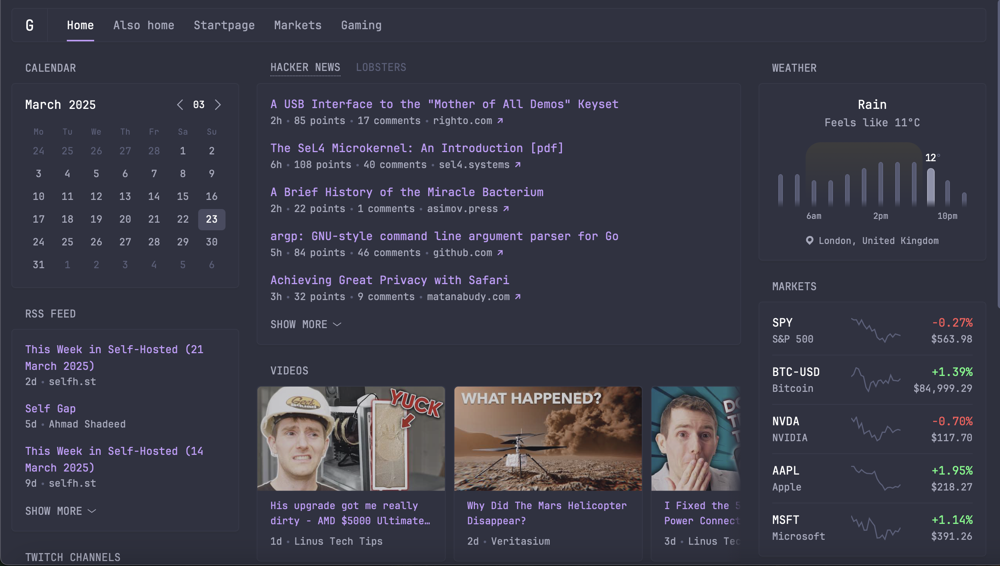
```yaml
theme:
  background-color: 231 15 21
  primary-color: 265 89 79
  contrast-multiplier: 1.2
  positive-color: 135 94 66
  negative-color: 0 100 67
```

## Light

### Catppuccin Latte
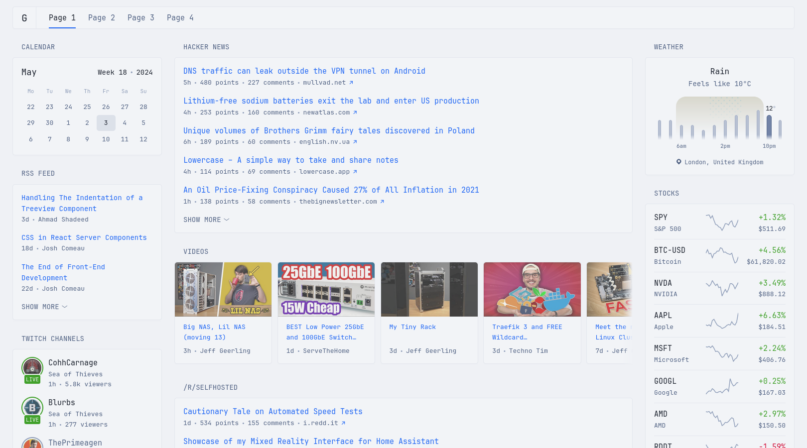
```yaml
theme:
  light: true
  background-color: 220 23 95
  contrast-multiplier: 1.0
  primary-color: 220 91 54
  positive-color: 109 58 40
  negative-color: 347 87 44
```

### Peachy
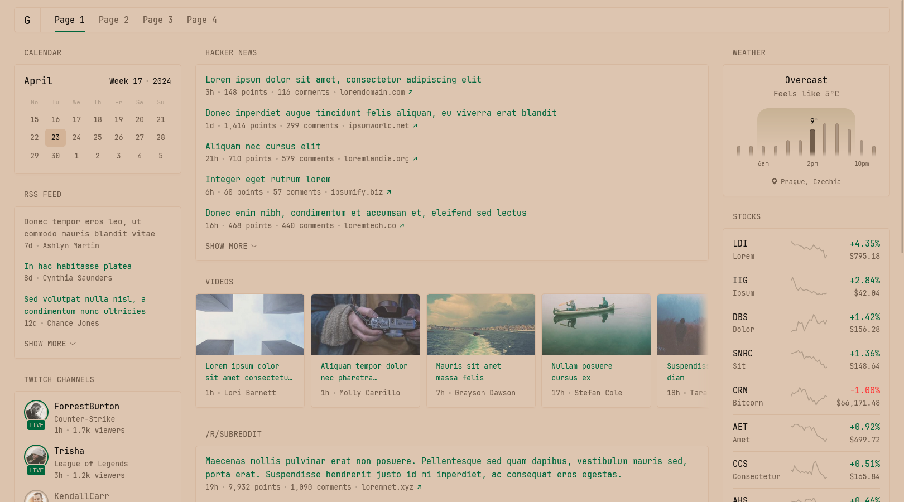
```yaml
theme:
  light: true
  background-color: 28 40 77
  primary-color: 155 100 20
  negative-color: 0 100 60
  contrast-multiplier: 1.1
  text-saturation-multiplier: 0.5
```

### Zebra
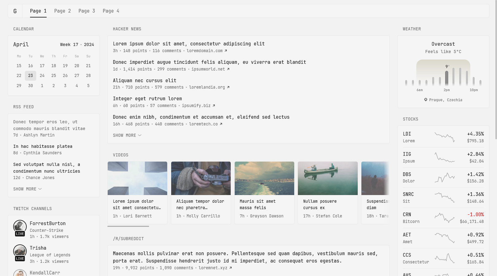
```yaml
theme:
  light: true
  background-color: 0 0 95
  primary-color: 0 0 10
  negative-color: 0 90 50
```
